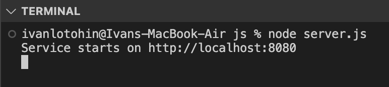

# Тестування працездатності системи
## Підключення до бази

## Зчитування всіх сутностей role (GET)

**Запит та відповідь**

## Зчитування сутностей role за id (GET) 

**Запит та відповідь** 

## Створення нової сутності role (POST)

**Запит**

**Відповідь**

## Оновлення сутності role (PUT)

**Запит**

**Відповідь**

## Видалення сутності role (DELETE)

**Запит**

**Відповідь**

## Зчитування всіх сутностей access (GET)

**Запит та відповідь**

## Зчитування сутностей access за id (GET)

**Запит та відповідь**

## Створення нової сутності access (POST)

**Запит**

**Відповідь**

## Оновлення сутності access (PUT)

**Запит**

**Відповідь**

## Видалення сутності access (DELETE)

**Запит**

**Відповідь**

